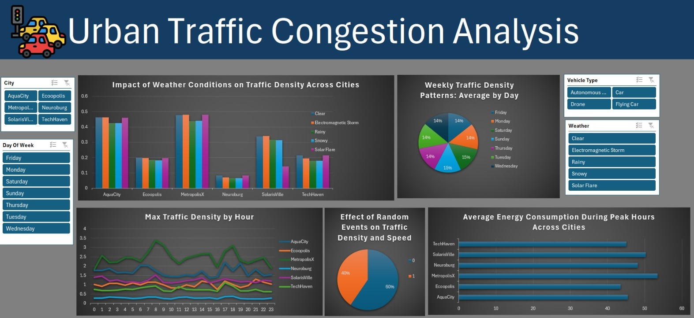

# Urban Traffic Congestion Analysis

## Project Overview
This project analyzes urban traffic congestion across six cities using a dataset sourced from Kaggle. The primary goal is to identify patterns, understand the impact of various factors on traffic density, and create actionable insights for better traffic management. The analysis results are visualized in a comprehensive dashboard.



## Features of Analysis
1. **Peak Traffic Hours**  
   Identified the hours of the day with the highest traffic density for each city.

2. **Impact of Weather Conditions**  
   Compared traffic density across different weather conditions, including Clear, Rainy, Snowy, Electromagnetic Storm, and Solar Flare.

3. **Energy Consumption**  
   Calculated and compared the average energy consumption during peak traffic hours for all cities to identify the most energy-intensive city.

4. **Effect of Random Events**  
   Assessed the impact of random events (e.g., accidents, road closures) on traffic density and speed.

5. **Traffic Density by Day of the Week**  
   Determined the day of the week with the highest average traffic density across all cities.

6. **Traffic Distribution Throughout the Day**  
   Analyzed how traffic density fluctuates throughout the day in all cities.

7. **Peak vs. Non-Peak Hour Analysis**  
   Compared traffic density during peak and non-peak hours for better understanding of congestion patterns.

8. **Traffic Stability Across Weather Conditions**  
   Measured variance in traffic density across different weather conditions to identify the city with the most stable traffic conditions.

## Dataset
- **Source**: [Kaggle](https://www.kaggle.com)  
- **Description**: The dataset contains traffic information, weather data, and energy consumption metrics for six cities.  
- **Preprocessing**: The dataset was cleaned to handle missing values, remove outliers, and standardize formats.

## Tools and Technologies
- **Data Analysis**: Python (Pandas, NumPy)  
- **Visualization**: Matplotlib, Seaborn, Plotly  
- **Dashboard**: Power BI/Tableau  
- **Version Control**: Git/GitHub

## How to Use
1. Clone this repository:
   ```bash
   git clone https://github.com/jotishkumar/Urban-Traffic-Congestion-Analysis.git
